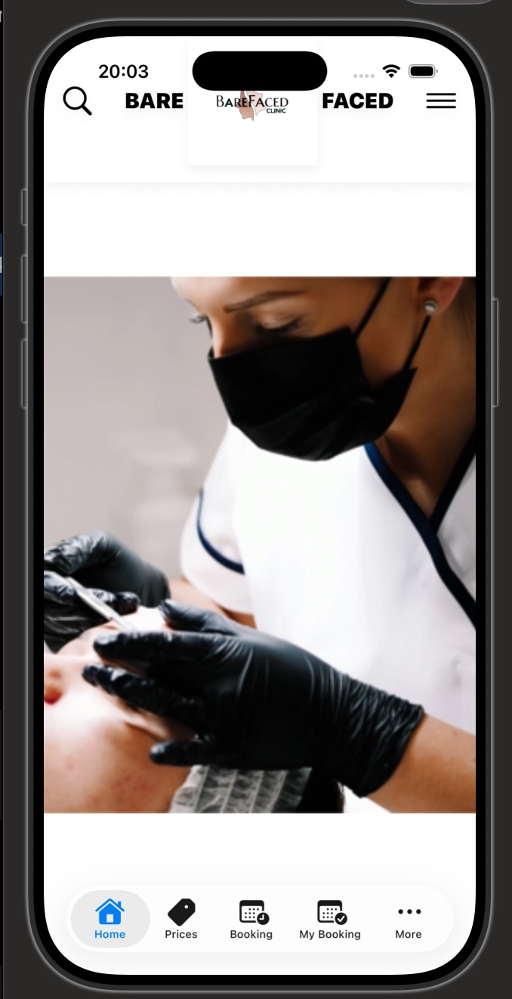
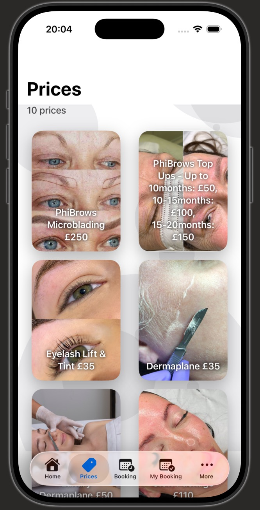
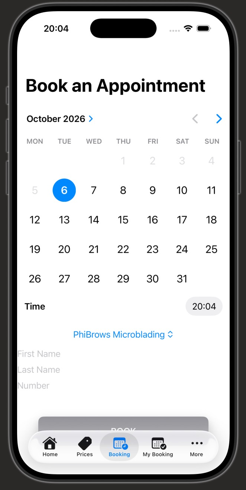
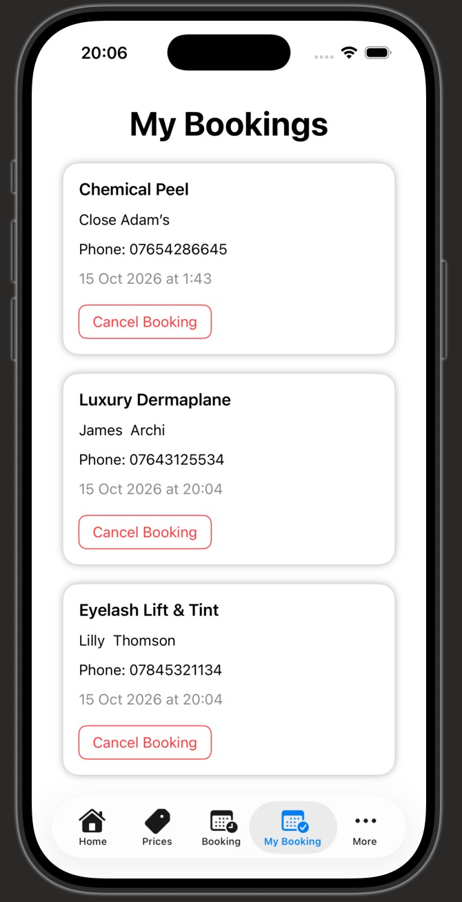
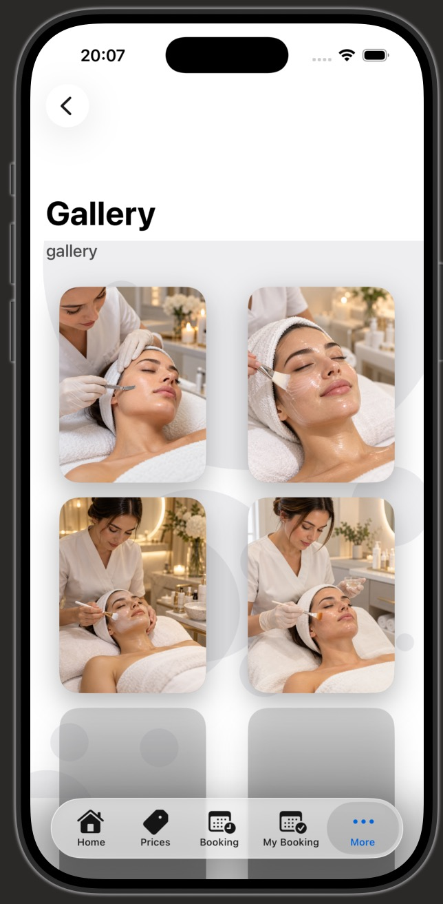
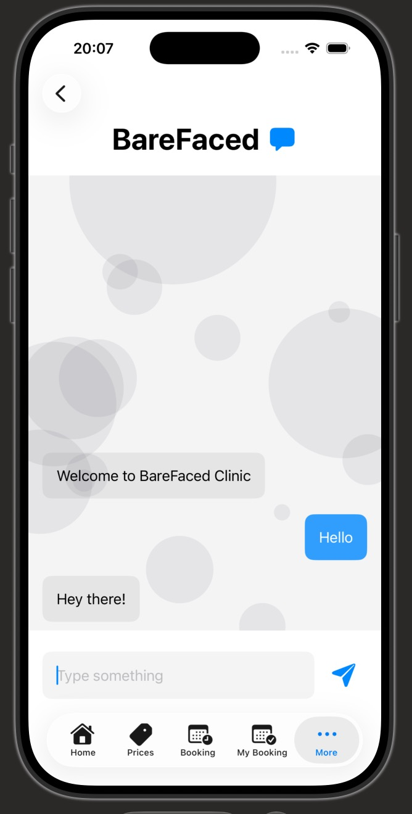

# BareFaced — iOS Beauty Booking Application

BareFaced is an iOS beauty booking application built using Swift and SwiftUI.

The app was designed around a real-world beauty clinic use case and allows customers to browse treatments, view prices, book appointments, manage bookings and explore a treatment gallery.

## 📱 App Screenshots

  
  
  

  
  
  

## Features

- Appointment booking
- Customer input validation
- Multiple booking management
- Persistent local booking storage
- Booking cancellation
- Treatment and pricing information
- Beauty treatment gallery
- Customer reviews
- Contact information
- Reusable SwiftUI components

## Technologies

- Swift
- SwiftUI
- Xcode
- UserDefaults
- Git
- GitHub

## What I Learned

This project helped me develop practical experience with:

- Building multi-screen iOS applications
- SwiftUI layouts and reusable components
- Managing application state
- User input validation
- Saving and retrieving local data
- Working with models and views
- Git version control
- Designing software around a real-world business use case

## Future Improvements

- Cloud database integration
- User authentication
- Online payment support
- Push notifications
- Admin appointment management
- Improved accessibility

## Author

**Muhammad Salih**  
Software Engineering Student at Bournemouth University
